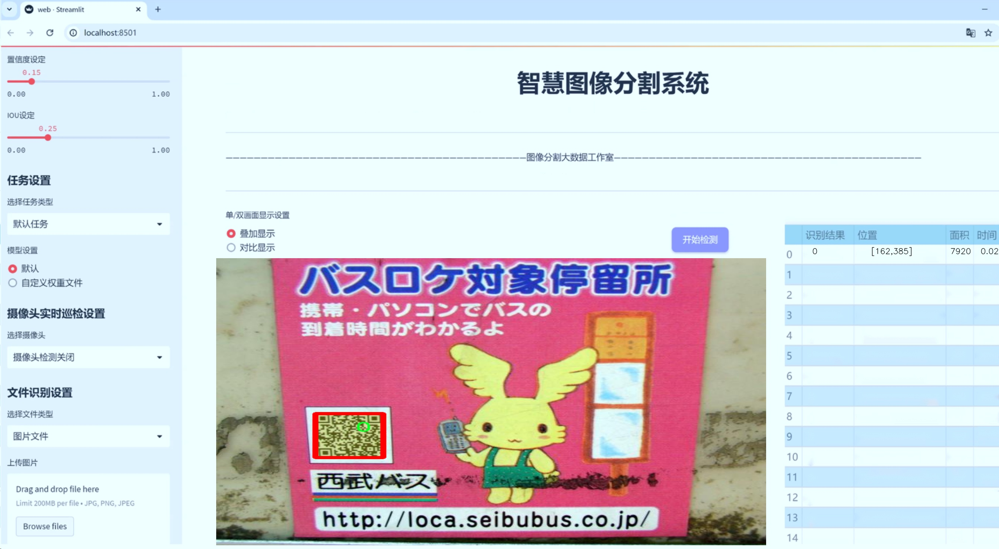
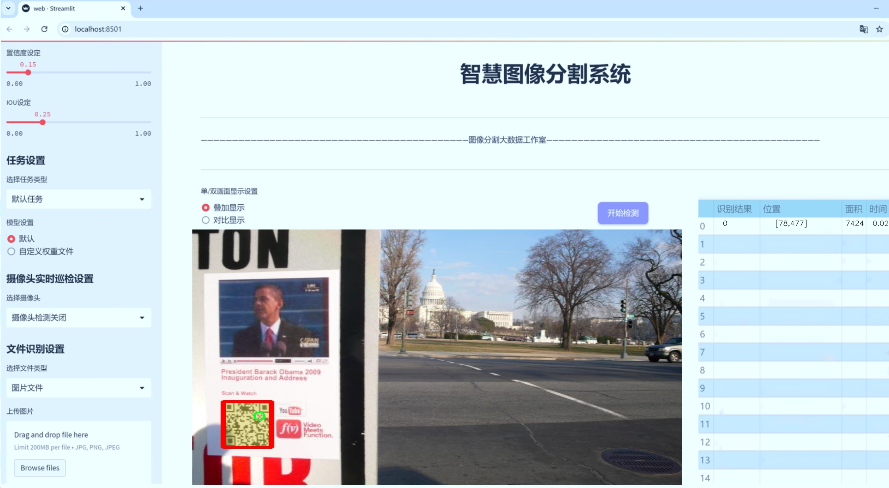
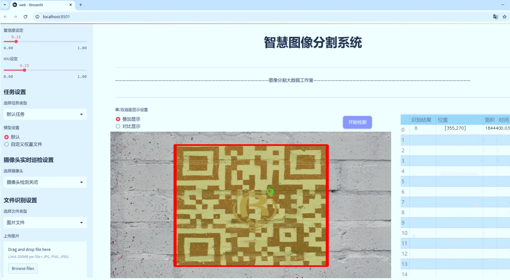
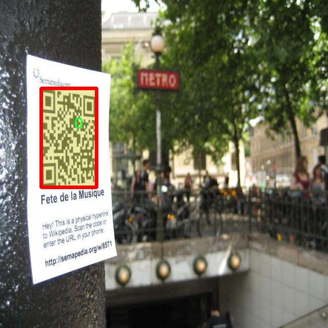
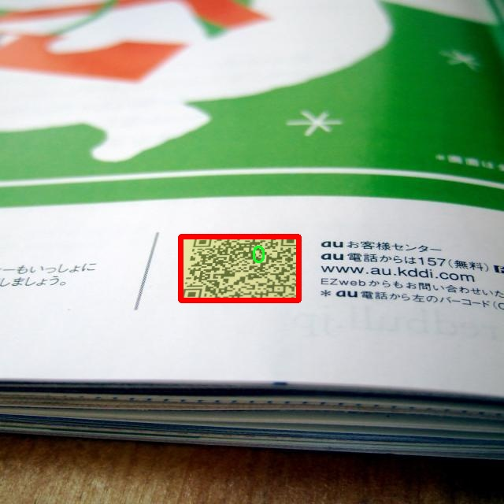
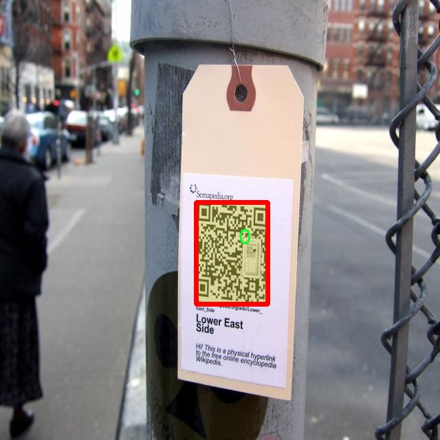
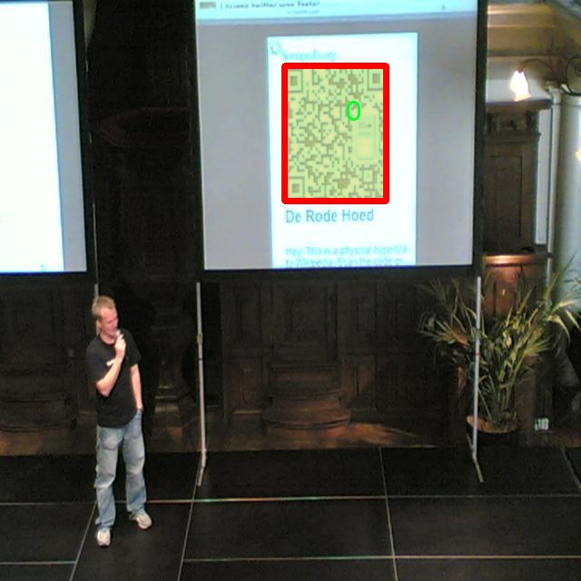
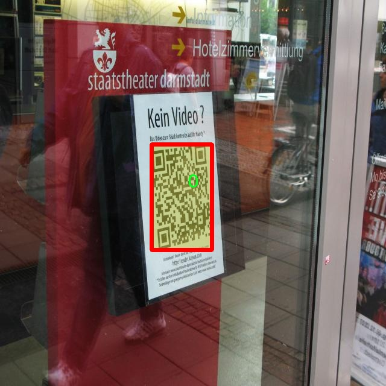

# 二维码图像分割系统源码＆数据集分享
 [yolov8-seg-C2f-RFCAConv＆yolov8-seg-efficientViT等50+全套改进创新点发刊_一键训练教程_Web前端展示]

### 1.研究背景与意义

项目参考[ILSVRC ImageNet Large Scale Visual Recognition Challenge](https://gitee.com/YOLOv8_YOLOv11_Segmentation_Studio/projects)

项目来源[AAAI Global Al lnnovation Contest](https://kdocs.cn/l/cszuIiCKVNis)

研究背景与意义

随着信息技术的迅猛发展，二维码作为一种便捷的信息传递方式，已广泛应用于商业、物流、支付等多个领域。二维码的快速识别和处理能力使其成为现代社会中不可或缺的一部分。然而，二维码的图像质量、环境因素及其在复杂背景下的表现，常常对其识别效果产生显著影响。因此，开发一种高效的二维码图像分割系统，能够在多种环境下准确识别和提取二维码信息，具有重要的理论价值和实际意义。

近年来，深度学习技术的飞速发展为图像处理领域带来了新的机遇，尤其是目标检测和图像分割方面。YOLO（You Only Look Once）系列模型因其高效的实时处理能力和良好的检测精度，已成为图像分割任务中的热门选择。YOLOv8作为该系列的最新版本，结合了多种先进的网络结构和算法优化，展现出更强的性能和适应性。然而，现有的YOLOv8模型在处理特定任务，如二维码图像分割时，仍存在一定的局限性。为此，基于改进YOLOv8的二维码图像分割系统的研究，旨在提升二维码在复杂环境下的识别准确率和处理速度。

本研究所使用的数据集“qrcode-640”包含2100幅二维码图像，虽然类别数量仅为1，但其丰富的样本量为模型的训练和验证提供了坚实的基础。通过对这些图像进行实例分割，可以更精确地提取二维码的轮廓信息，进而提高后续识别的准确性。此外，针对二维码的特性，研究将结合数据增强技术，提升模型在不同光照、角度和背景下的鲁棒性。这一过程不仅有助于提升模型的泛化能力，也为二维码在实际应用中的广泛推广提供了技术支持。

在实际应用中，二维码的图像分割系统可以广泛应用于智能手机扫码、无人机巡检、工业自动化等多个领域。通过提高二维码的识别效率，能够有效减少人力成本，提高工作效率。同时，该系统的成功应用还将推动二维码技术在更多新兴领域的拓展，如物联网、智能城市等，为未来的数字化发展提供新的动力。

综上所述，基于改进YOLOv8的二维码图像分割系统的研究，不仅具有重要的学术价值，推动了图像处理领域的技术进步，也在实际应用中展现出广泛的市场前景。通过深入探讨二维码图像分割的相关技术，期望为相关研究提供新的思路和方法，助力二维码技术的进一步发展与应用。

### 2.图片演示







##### 注意：由于此博客编辑较早，上面“2.图片演示”和“3.视频演示”展示的系统图片或者视频可能为老版本，新版本在老版本的基础上升级如下：（实际效果以升级的新版本为准）

  （1）适配了YOLOV8的“目标检测”模型和“实例分割”模型，通过加载相应的权重（.pt）文件即可自适应加载模型。

  （2）支持“图片识别”、“视频识别”、“摄像头实时识别”三种识别模式。

  （3）支持“图片识别”、“视频识别”、“摄像头实时识别”三种识别结果保存导出，解决手动导出（容易卡顿出现爆内存）存在的问题，识别完自动保存结果并导出到tempDir中。

  （4）支持Web前端系统中的标题、背景图等自定义修改，后面提供修改教程。

  另外本项目提供训练的数据集和训练教程,暂不提供权重文件（best.pt）,需要您按照教程进行训练后实现图片演示和Web前端界面演示的效果。

### 3.视频演示

[3.1 视频演示](https://www.bilibili.com/video/BV1jGSvYxEyD/)

### 4.数据集信息展示

##### 4.1 本项目数据集详细数据（类别数＆类别名）

nc: 1
names: ['0']


##### 4.2 本项目数据集信息介绍

数据集信息展示

在本研究中，我们采用了名为“qrcode-640”的数据集，以训练和改进YOLOv8-seg的二维码图像分割系统。该数据集专门设计用于处理二维码图像，旨在提高图像分割的精度和效率。二维码作为一种广泛应用于信息传递和数据存储的图形编码方式，其图像分割的准确性直接影响到后续信息提取和解码的效果。因此，构建一个高质量的二维码图像分割数据集显得尤为重要。

“qrcode-640”数据集的核心特征在于其类别数量和类别列表的简洁性。该数据集仅包含一个类别，类别数量（nc）为1，类别名称为‘0’。这一设计使得数据集在处理二维码图像时，能够专注于特定的目标，避免了多类别干扰带来的复杂性。通过将所有二维码图像统一标记为同一类别，模型能够更好地学习二维码的特征，从而提高分割效果。这种单一类别的设置，特别适合于需要高精度分割的应用场景，例如自动化扫码系统、智能物流追踪和移动支付等领域。

在数据集的构建过程中，研究团队注重了数据的多样性和代表性。虽然类别数量仅为1，但“qrcode-640”数据集涵盖了多种不同环境下拍摄的二维码图像，包括不同的光照条件、背景复杂度以及二维码的尺寸和形状变化。这种多样性确保了模型在训练过程中能够接触到各种可能的二维码图像，从而提升其在实际应用中的鲁棒性和适应性。

此外，为了增强模型的泛化能力，数据集还进行了数据增强处理。通过对原始二维码图像进行旋转、缩放、翻转和颜色调整等操作，研究团队生成了大量变体图像。这些变体不仅丰富了训练样本的数量，也使得模型能够更好地适应不同的二维码展示方式。这种数据增强策略在深度学习中被广泛应用，能够有效防止模型过拟合，提高其在未见数据上的表现。

在数据标注方面，研究团队采用了精确的标注方法，确保每个二维码的边界都被准确地框定。这种高质量的标注为YOLOv8-seg模型的训练提供了坚实的基础，使得模型能够在分割任务中实现更高的准确率和召回率。数据集的标注过程经过严格的审核和验证，确保每一张图像的标注信息都真实可靠。

综上所述，“qrcode-640”数据集凭借其单一类别的设计、多样化的图像样本、有效的数据增强策略以及高质量的标注，为改进YOLOv8-seg的二维码图像分割系统提供了强有力的支持。通过对该数据集的深入研究和应用，我们期望能够推动二维码图像分割技术的发展，提升其在实际应用中的效果和效率。











### 5.全套项目环境部署视频教程（零基础手把手教学）

[5.1 环境部署教程链接（零基础手把手教学）](https://www.bilibili.com/video/BV1jG4Ve4E9t/?vd_source=bc9aec86d164b67a7004b996143742dc)


[5.2 安装Python虚拟环境创建和依赖库安装视频教程链接（零基础手把手教学）](https://www.bilibili.com/video/BV1nA4VeYEze/?vd_source=bc9aec86d164b67a7004b996143742dc)

### 6.手把手YOLOV8-seg训练视频教程（零基础小白有手就能学会）

[6.1 手把手YOLOV8-seg训练视频教程（零基础小白有手就能学会）](https://www.bilibili.com/video/BV1cA4VeYETe/?vd_source=bc9aec86d164b67a7004b996143742dc)


按照上面的训练视频教程链接加载项目提供的数据集，运行train.py即可开始训练



     Epoch   gpu_mem       box       obj       cls    labels  img_size
     1/200     0G   0.01576   0.01955  0.007536        22      1280: 100%|██████████| 849/849 [14:42<00:00,  1.04s/it]
               Class     Images     Labels          P          R     mAP@.5 mAP@.5:.95: 100%|██████████| 213/213 [01:14<00:00,  2.87it/s]
                 all       3395      17314      0.994      0.957      0.0957      0.0843

     Epoch   gpu_mem       box       obj       cls    labels  img_size
     2/200     0G   0.01578   0.01923  0.007006        22      1280: 100%|██████████| 849/849 [14:44<00:00,  1.04s/it]
               Class     Images     Labels          P          R     mAP@.5 mAP@.5:.95: 100%|██████████| 213/213 [01:12<00:00,  2.95it/s]
                 all       3395      17314      0.996      0.956      0.0957      0.0845

     Epoch   gpu_mem       box       obj       cls    labels  img_size
     3/200     0G   0.01561    0.0191  0.006895        27      1280: 100%|██████████| 849/849 [10:56<00:00,  1.29it/s]
               Class     Images     Labels          P          R     mAP@.5 mAP@.5:.95: 100%|███████   | 187/213 [00:52<00:00,  4.04it/s]
                 all       3395      17314      0.996      0.957      0.0957      0.0845


### 7.50+种全套YOLOV8-seg创新点代码加载调参视频教程（一键加载写好的改进模型的配置文件）

[7.1 50+种全套YOLOV8-seg创新点代码加载调参视频教程（一键加载写好的改进模型的配置文件）](https://www.bilibili.com/video/BV1Hw4VePEXv/?vd_source=bc9aec86d164b67a7004b996143742dc)

### 8.YOLOV8-seg图像分割算法原理

原始YOLOv8-seg算法原理

YOLOv8-seg算法是YOLO系列中的最新版本，专注于目标检测与分割任务的结合，展现了其在实时计算与高精度目标识别方面的卓越性能。该算法的设计理念是通过整合多种先进的网络结构与技术，形成一个高效、灵活且易于扩展的框架。YOLOv8-seg不仅继承了YOLO系列的优良传统，还在特征提取、特征融合和目标检测等方面进行了重要的创新。

在YOLOv8-seg的架构中，输入层首先对待处理的图像进行缩放，以适应网络的输入要求。这一过程确保了不同尺寸的图像能够被统一处理，从而提高了模型的适应性和鲁棒性。接下来，主干网络通过一系列卷积操作对图像进行下采样，提取出丰富的特征信息。每个卷积层都结合了批归一化和SiLUR激活函数，这不仅加速了训练过程，还提高了模型的非线性表达能力。主干网络中的C2f模块则借鉴了YOLOv7中的E-ELAN结构，通过跨层分支连接的方式，增强了模型的梯度流动性，进而改善了检测效果。

在特征提取的最后阶段，主干网络使用快速空间金字塔池化（SPPFl）模块，该模块通过三个最大池化层处理多尺度特征，进一步提升了网络的特征抽象能力。这一设计使得YOLOv8-seg能够在面对不同尺度的目标时，依然保持较高的检测精度。

接下来，颈部网络（Neck）通过融合来自主干网络不同层次的特征图，利用FPNS（特征金字塔网络）和PAN（路径聚合网络）结构，进一步增强了特征的表达能力。FPNS负责在不同尺度之间进行信息的有效传递，而PAN则通过聚合不同层次的特征，提升了对小目标的检测能力。这种多尺度特征融合的策略，使得YOLOv8-seg在复杂场景下的目标检测性能得到了显著提升。

在YOLOv8-seg的头部网络（Head）中，采用了解耦的检测头设计，通过两个并行的卷积分支分别计算回归和类别的损失。这种设计使得模型在处理目标检测任务时，能够更为精准地进行位置回归与类别判别。头部网络的输出不仅包含目标的位置信息，还能够生成每个目标的分割掩码，从而实现目标的精确分割。

值得注意的是，YOLOv8-seg在训练过程中引入了新的损失函数设计，旨在提高模型对目标边界的敏感性。这一创新使得YOLOv8-seg在处理复杂背景和目标重叠的情况下，依然能够保持较高的分割精度。此外，YOLOv8-seg还采用了先进的数据增强技术，通过对输入图像进行多样化的变换，提升了模型的泛化能力。

在实际应用中，YOLOv8-seg的高效性与灵活性使其在多个领域中展现出广泛的应用潜力。例如，在农业领域，YOLOv8-seg能够被用于果实的自动检测与分割，帮助农民提高采摘效率。在自动驾驶领域，该算法能够实时识别和分割道路上的行人、车辆及其他障碍物，为安全驾驶提供保障。此外，YOLOv8-seg还可以应用于医学影像分析，通过对医学图像的目标检测与分割，辅助医生进行疾病的早期诊断。

总的来说，YOLOv8-seg算法通过整合多种先进的技术与设计理念，形成了一个高效、精准的目标检测与分割框架。其在特征提取、特征融合和目标检测等方面的创新，使得YOLOv8-seg在面对复杂场景时，依然能够保持卓越的性能。这一算法的推出，不仅为目标检测领域带来了新的突破，也为相关应用的落地提供了强有力的技术支持。随着YOLOv8-seg的不断发展与完善，未来我们有理由相信，它将在更多实际场景中发挥重要作用，推动目标检测与分割技术的进一步进步。


### 9.系统功能展示（检测对象为举例，实际内容以本项目数据集为准）

图9.1.系统支持检测结果表格显示

  图9.2.系统支持置信度和IOU阈值手动调节

  图9.3.系统支持自定义加载权重文件best.pt(需要你通过步骤5中训练获得)

  图9.4.系统支持摄像头实时识别

  图9.5.系统支持图片识别

  图9.6.系统支持视频识别

  图9.7.系统支持识别结果文件自动保存

  图9.8.系统支持Excel导出检测结果数据


### 10.50+种全套YOLOV8-seg创新点原理讲解（非科班也可以轻松写刊发刊，V11版本正在科研待更新）

#### 10.1 由于篇幅限制，每个创新点的具体原理讲解就不一一展开，具体见下列网址中的创新点对应子项目的技术原理博客网址【Blog】：


[10.1 50+种全套YOLOV8-seg创新点原理讲解链接](https://gitee.com/qunmasj/good)

#### 10.2 部分改进模块原理讲解(完整的改进原理见上图和技术博客链接)【如果此小节的图加载失败可以通过CSDN或者Github搜索该博客的标题访问原始博客，原始博客图片显示正常】
### YOLOv8简介
YOLO（You Only Look Once）是一种流行的对象检测和图像分割模型，由华盛顿大学的Joseph Redmon和Ali Farhadi开发。YOLO于2015年推出，以其高速度和高精度迅速走红。

YOLOv2于2016年发布，通过合并批处理规范化、锚盒和维度集群来改进原始模型
2018年推出的YOLOv3使用更高效的骨干网络、多个锚点和空间金字塔池进一步增强了该模型的性能
YOLOv4于2020年发布，引入了Mosaic数据增强、新的无锚检测头和新的丢失功能等创新
YOLOv5进一步提高了模型的性能，并添加了超参数优化、集成实验跟踪和自动导出到流行导出格式等新功能
YOLOv6于2022年由美团开源，目前正在该公司的许多自动配送机器人中使用
YOLOv7在COCO关键点数据集上添加了额外的任务，如姿态估计
YOLOv8是Ultralytics公司推出的YOLO的最新版本。作为一款尖端、最先进的（SOTA）车型，YOLOv8在之前版本的成功基础上，引入了新的功能和改进，以增强性能、灵活性和效率。YOLOv8支持全方位的视觉AI任务，包括检测、分割、姿态估计、跟踪和分类。这种多功能性允许用户在不同的应用程序和域中利用YOLOv8的功能
#### YOLOv8的新特性与可用模型

Ultralytics 并没有直接将开源库命名为 YOLOv8，而是直接使用 ultralytics 这个词，原因是 ultralytics 将这个库定位为算法框架，而非某一个特定算法，一个主要特点是可扩展性。其希望这个库不仅仅能够用于 YOLO 系列模型，而是能够支持非 YOLO 模型以及分类分割姿态估计等各类任务。总而言之，ultralytics 开源库的两个主要优点是：

融合众多当前 SOTA 技术于一体
未来将支持其他 YOLO 系列以及 YOLO 之外的更多算法
Ultralytics为YOLO模型发布了一个全新的存储库。它被构建为 用于训练对象检测、实例分割和图像分类模型的统一框架。

提供了一个全新的 SOTA 模型，包括 P5 640 和 P6 1280 分辨率的目标检测网络和基于 YOLACT 的实例分割模型。和 YOLOv5 一样，基于缩放系数也提供了 N/S/M/L/X 尺度的不同大小模型，用于满足不同场景需求
骨干网络和 Neck 部分可能参考了 YOLOv7 ELAN 设计思想，将 YOLOv5 的 C3 结构换成了梯度流更丰富的 C2f 结构，并对不同尺度模型调整了不同的通道数，属于对模型结构精心微调，不再是无脑一套参数应用所有模型，大幅提升了模型性能。不过这个 C2f 模块中存在 Split 等操作对特定硬件部署没有之前那么友好了
Head 部分相比 YOLOv5 改动较大，换成了目前主流的解耦头结构，将分类和检测头分离，同时也从 Anchor-Based 换成了 Anchor-Free
Loss 计算方面采用了 TaskAlignedAssigner 正样本分配策略，并引入了 Distribution Focal Loss
训练的数据增强部分引入了 YOLOX 中的最后 10 epoch 关闭 Mosiac 增强的操作，可以有效地提升精度
YOLOv8 还高效灵活地支持多种导出格式，并且该模型可以在 CPU 和 GPU 上运行。YOLOv8 模型的每个类别中有五个模型用于检测、分割和分类。YOLOv8 Nano 是最快和最小的，而 YOLOv8 Extra Large (YOLOv8x) 是其中最准确但最慢的。


### FocalModulation模型的基本原理
参考该博客，Focal Modulation Networks（FocalNets）的基本原理是替换自注意力（Self-Attention）模块，使用焦点调制（focal modulation）机制来捕捉图像中的长距离依赖和上下文信息。下图是自注意力和焦点调制两种方法的对比。


自注意力要求对每个查询令牌（Query Token）与其他令牌进行复杂的查询-键（Query-Key）交互和查询-值（Query-Value）聚合，以计算注意力分数并捕捉上下文。而焦点调制则先将空间上下文以不同粒度聚合到调制器中，然后以查询依赖的方式将这些调制器注入到查询令牌中。焦点调制简化了交互和聚合操作，使其更轻量级。在图中，自注意力部分使用红色虚线表示查询-键交互和黄色虚线表示查询-值聚合，而焦点调制部分则用蓝色表示调制器聚合和黄色表示查询-调制器交互。 

FocalModulation模型通过以下步骤实现：

1. 焦点上下文化：用深度卷积层堆叠来编码不同范围的视觉上下文。


2. 门控聚合：通过门控机制，选择性地将上下文信息聚合到每个查询令牌的调制器中。


3. 逐元素仿射变换：将聚合后的调制器通过仿射变换注入到每个查询令牌中。

下面来分别介绍这三个机制->

#### 焦点上下文化
焦点上下文化（Focal Contextualization）是焦点调制（Focal Modulation）的一个组成部分。焦点上下文化使用一系列深度卷积层（depth-wise convolutional layers）来编码不同范围内的视觉上下文信息。这些层可以捕捉从近处到远处的视觉特征，从而允许网络在不同层次上理解图像内容。通过这种方式，网络能够在聚合上下文信息时保持对局部细节的敏感性，并增强对全局结构的认识。


​

这张图详细比较了自注意力（Self-Attention, SA）和焦点调制（Focal Modulation）的机制，并特别展示了焦点调制中的上下文聚合过程。左侧的图展示了自注意力模型如何通过键（k）和查询（q）之间的交互，以及随后的聚合来生成输出。而中间和右侧的图说明了焦点调制如何通过层级化的上下文聚合和门控聚合过程替代自注意力模型的这一过程。在焦点调制中，输入首先通过轻量级线性层进行处理，然后通过层级化的上下文化模块和门控机制来选择性地聚合信息，最终通过调制器与查询（q）进行交互以生成输出。

#### 门控聚合
在Focal Modulation Networks（FocalNets）中的 "门控聚合"（Gated Aggregation）是关键组件之一，这一过程涉及使用门控机制来选择性地聚合上下文信息。以下是这个过程的详细分析：

1. 什么是门控机制？
门控机制在深度学习中常用于控制信息流。它通常用于决定哪些信息应该被传递，哪些应该被阻断。在循环神经网络（RNN）中，特别是在长短期记忆网络（LSTM）和门控循环单元（GRU）中，门控机制用于调节信息在时间序列数据中的流动。

2. 门控聚合的目的
在FocalNets中，门控聚合的目的是为每个查询令牌（即处理中的数据单元）选择性地聚合上下文信息。这意味着网络能够决定哪些特定的上下文信息对于当前处理的查询令牌是重要的，从而专注于那些最相关的信息。

3. 如何实现门控聚合？
实现门控聚合可能涉及一系列计算步骤，其中包括：

计算上下文信息：这可能涉及使用深度卷积层（如文中提到的）对输入图像的不同区域进行编码，以捕捉从局部到全局的视觉上下文。
门控操作：这一步骤涉及到一个决策过程，根据当前查询令牌的特征来决定哪些上下文信息是相关的。这可能通过一个学习到的权重（门）来实现，该权重决定了不同上下文信息的重要性。
信息聚合：最后，根据门控操作的结果，选择性地聚合上下文信息到一个调制器中。这个调制器随后被用于调整或“调制”查询令牌的表示。
4. 门控聚合的好处
通过门控聚合，FocalNets能够更有效地聚焦于对当前任务最关键的信息。这种方法提高了模型的效率和性能，因为它减少了不必要信息的处理，同时增强了对关键特征的关注。在视觉任务中，这可能意味着更好的目标检测和图像分类性能，特别是在复杂或多变的视觉环境中。

总结：门控聚合是FocalNets的一个核心组成部分，它通过选择性地集中处理重要的上下文信息来提升网络的效率和性能。

#### 逐元素仿射变换
在Focal Modulation Networks（FocalNets）中的第三个关键组件是逐元素仿射变换，这个步骤涉及将通过门控聚合得到的调制器注入到每个查询令牌中。以下是该过程的详细分析：

1. 仿射变换的基本概念：
仿射变换是一种线性变换，用于对数据进行缩放、旋转、平移和倾斜等操作。在深度学习中，逐元素的仿射变换通常指的是对每个元素进行线性变换，这种变换可以被描述为y = ax + b，其中x是输入，y是输出，a和b是变换的参数。

2. 逐元素仿射变换的作用：
在FocalNets中，逐元素仿射变换的作用是将聚合后的调制器信息注入到每个查询令牌中。这个步骤对于整合上下文信息和查询令牌的原始特征非常重要。通过这种方式，调制器所包含的上下文信息可以直接影响查询令牌的表示。

3. 执行仿射变换：
执行这一步骤时，聚合后的调制器对每个查询令牌进行逐元素的仿射变换。在实践中，这可能意味着对查询令牌的每个特征应用调制器中的相应权重（a）和偏差（b）。这样，调制器中的每个元素都直接对应于查询令牌的一个特征，通过调整这些特征来改变其表达。

4. 仿射变换的效果：
通过逐元素仿射变换，模型能够更细致地调整每个查询令牌的特征，根据上下文信息来增强或抑制某些特征。这种精细的调整机制允许网络更好地适应复杂的视觉场景，提高对细节的捕捉能力，从而提升了模型在各种视觉任务中的性能，如目标检测和图像分类。

总结：逐元素仿射变换它使得模型能够利用上下文信息来有效地调整查询令牌，增强了模型对关键视觉特征的捕捉和表达能力。


### 11.项目核心源码讲解（再也不用担心看不懂代码逻辑）

#### 11.1 ultralytics\solutions\object_counter.py

以下是对代码的逐文件分析，保留了最核心的部分，并添加了详细的中文注释：

```python
# Ultralytics YOLO 🚀, AGPL-3.0 license

from collections import defaultdict
import cv2
from ultralytics.utils.checks import check_requirements
from ultralytics.utils.plotting import Annotator, colors
from shapely.geometry import Polygon
from shapely.geometry.point import Point

# 检查所需的库是否已安装
check_requirements('shapely>=2.0.0')

class ObjectCounter:
    """用于管理实时视频流中基于轨迹的物体计数的类。"""

    def __init__(self):
        """初始化计数器，设置各种跟踪和计数参数的默认值。"""
        # 鼠标事件
        self.is_drawing = False  # 是否正在绘制
        self.selected_point = None  # 选中的点

        # 区域信息
        self.reg_pts = None  # 区域点
        self.counting_region = None  # 计数区域
        self.region_color = (255, 255, 255)  # 区域颜色

        # 图像和注释信息
        self.im0 = None  # 当前图像
        self.tf = None  # 线条厚度
        self.view_img = False  # 是否显示图像

        self.names = None  # 类别名称
        self.annotator = None  # 注释器

        # 物体计数信息
        self.in_counts = 0  # 进入计数
        self.out_counts = 0  # 离开计数
        self.counting_list = []  # 计数列表

        # 轨迹信息
        self.track_history = defaultdict(list)  # 轨迹历史
        self.track_thickness = 2  # 轨迹线条厚度
        self.draw_tracks = False  # 是否绘制轨迹

    def set_args(self, classes_names, reg_pts, region_color=None, line_thickness=2, track_thickness=2, view_img=False, draw_tracks=False):
        """
        配置计数器的图像、边界框线条厚度和计数区域点。

        Args:
            classes_names (dict): 类别名称
            reg_pts (list): 定义计数区域的初始点列表
            region_color (tuple): 区域线条颜色
            line_thickness (int): 边界框线条厚度
            track_thickness (int): 轨迹线条厚度
            view_img (bool): 是否显示视频流
            draw_tracks (bool): 是否绘制轨迹
        """
        self.tf = line_thickness
        self.view_img = view_img
        self.track_thickness = track_thickness
        self.draw_tracks = draw_tracks
        self.reg_pts = reg_pts
        self.counting_region = Polygon(self.reg_pts)  # 使用区域点创建多边形
        self.names = classes_names
        self.region_color = region_color if region_color else self.region_color

    def extract_and_process_tracks(self, tracks):
        """
        提取并处理跟踪数据，更新计数和绘制信息。

        Args:
            tracks (list): 从物体跟踪过程中获得的轨迹列表。
        """
        boxes = tracks[0].boxes.xyxy.cpu()  # 获取边界框坐标
        clss = tracks[0].boxes.cls.cpu().tolist()  # 获取类别
        track_ids = tracks[0].boxes.id.int().cpu().tolist()  # 获取轨迹ID

        self.annotator = Annotator(self.im0, self.tf, self.names)  # 初始化注释器
        self.annotator.draw_region(reg_pts=self.reg_pts, color=(0, 255, 0))  # 绘制计数区域

        for box, track_id, cls in zip(boxes, track_ids, clss):
            self.annotator.box_label(box, label=self.names[cls], color=colors(int(cls), True))  # 绘制边界框

            # 更新轨迹
            track_line = self.track_history[track_id]
            track_line.append((float((box[0] + box[2]) / 2), float((box[1] + box[3]) / 2)))  # 记录中心点
            track_line.pop(0) if len(track_line) > 30 else None  # 限制轨迹长度

            if self.draw_tracks:
                self.annotator.draw_centroid_and_tracks(track_line, color=(0, 255, 0), track_thickness=self.track_thickness)  # 绘制轨迹

            # 计数物体
            if self.counting_region.contains(Point(track_line[-1])):  # 检查是否在计数区域内
                if track_id not in self.counting_list:  # 如果该ID未被计数
                    self.counting_list.append(track_id)  # 添加到计数列表
                    if box[0] < self.counting_region.centroid.x:  # 判断物体是进入还是离开
                        self.out_counts += 1
                    else:
                        self.in_counts += 1

        if self.view_img:  # 如果需要显示图像
            incount_label = 'InCount : ' + f'{self.in_counts}'  # 进入计数标签
            outcount_label = 'OutCount : ' + f'{self.out_counts}'  # 离开计数标签
            self.annotator.count_labels(in_count=incount_label, out_count=outcount_label)  # 显示计数标签
            cv2.namedWindow('Ultralytics YOLOv8 Object Counter')  # 创建窗口
            cv2.imshow('Ultralytics YOLOv8 Object Counter', self.im0)  # 显示图像
            if cv2.waitKey(1) & 0xFF == ord('q'):  # 按'q'退出
                return

    def start_counting(self, im0, tracks):
        """
        启动物体计数过程的主函数。

        Args:
            im0 (ndarray): 当前视频流的帧。
            tracks (list): 从物体跟踪过程中获得的轨迹列表。
        """
        self.im0 = im0  # 存储当前图像
        if tracks[0].boxes.id is None:  # 如果没有检测到物体
            return
        self.extract_and_process_tracks(tracks)  # 提取并处理轨迹

if __name__ == '__main__':
    ObjectCounter()  # 创建ObjectCounter实例
```

### 代码核心部分分析：
1. **类定义**：`ObjectCounter`类用于管理实时视频流中的物体计数。
2. **初始化方法**：设置初始参数，包括鼠标事件、区域信息、图像信息、计数信息等。
3. **参数设置方法**：`set_args`方法用于配置计数器的各种参数，包括区域点、颜色和线条厚度等。
4. **轨迹提取与处理**：`extract_and_process_tracks`方法负责处理检测到的物体轨迹，更新计数并绘制相应的图形。
5. **计数逻辑**：通过判断物体中心点是否在计数区域内来更新进入和离开的计数。
6. **显示图像**：在窗口中显示当前图像及计数信息，并处理鼠标事件。

以上代码和注释提供了一个清晰的框架，便于理解物体计数的实现逻辑。

这个文件定义了一个名为 `ObjectCounter` 的类，主要用于在实时视频流中基于物体的轨迹进行计数。首先，文件导入了一些必要的库，包括 `cv2`（OpenCV），以及 `shapely` 库用于处理几何形状。接着，类的构造函数 `__init__` 初始化了一些默认值，包括鼠标事件的状态、计数区域的信息、图像和注释信息、物体计数信息以及轨迹信息。

在 `set_args` 方法中，用户可以配置计数器的参数，包括类名、计数区域的点、区域颜色、线条厚度等。这些参数会影响后续的计数和可视化效果。

`mouse_event_for_region` 方法处理鼠标事件，允许用户通过鼠标在视频流中绘制和调整计数区域。用户可以通过左键点击选择区域的点，移动鼠标来调整点的位置，并在释放鼠标左键时结束调整。

`extract_and_process_tracks` 方法是核心功能之一，它提取并处理传入的物体轨迹。首先，它从轨迹中获取边界框、类别和轨迹ID。然后，使用 `Annotator` 类来绘制计数区域和物体的边界框。对于每个物体，程序会检查其中心点是否在计数区域内，并根据物体的运动方向更新进入和离开的计数。

最后，`start_counting` 方法是启动计数过程的主函数。它接收当前帧图像和物体轨迹，调用 `extract_and_process_tracks` 方法进行处理。

在文件的最后部分，`if __name__ == '__main__':` 语句确保当文件作为主程序运行时，会创建一个 `ObjectCounter` 实例。整体来看，这个类为实时视频中的物体计数提供了一个完整的解决方案，结合了图形界面和鼠标交互功能，使得用户可以灵活地定义计数区域并实时查看计数结果。

#### 11.2 ultralytics\nn\extra_modules\dynamic_snake_conv.py

以下是代码中最核心的部分，并附上详细的中文注释：

```python
import torch
import torch.nn as nn

class DySnakeConv(nn.Module):
    def __init__(self, inc, ouc, k=3) -> None:
        super().__init__()
        # 初始化三个卷积层
        self.conv_0 = Conv(inc, ouc, k)  # 标准卷积
        self.conv_x = DSConv(inc, ouc, 0, k)  # 沿x轴的动态蛇形卷积
        self.conv_y = DSConv(inc, ouc, 1, k)  # 沿y轴的动态蛇形卷积
    
    def forward(self, x):
        # 前向传播，连接三个卷积的输出
        return torch.cat([self.conv_0(x), self.conv_x(x), self.conv_y(x)], dim=1)

class DSConv(nn.Module):
    def __init__(self, in_ch, out_ch, morph, kernel_size=3, if_offset=True, extend_scope=1):
        """
        动态蛇形卷积
        :param in_ch: 输入通道数
        :param out_ch: 输出通道数
        :param kernel_size: 卷积核大小
        :param extend_scope: 扩展范围（默认1）
        :param morph: 卷积核的形态，分为沿x轴（0）和y轴（1）
        :param if_offset: 是否需要偏移，False时为标准卷积
        """
        super(DSConv, self).__init__()
        # 用于学习可变形偏移的卷积层
        self.offset_conv = nn.Conv2d(in_ch, 2 * kernel_size, 3, padding=1)
        self.bn = nn.BatchNorm2d(2 * kernel_size)  # 批归一化
        self.kernel_size = kernel_size

        # 定义沿x轴和y轴的动态蛇形卷积
        self.dsc_conv_x = nn.Conv2d(
            in_ch,
            out_ch,
            kernel_size=(kernel_size, 1),
            stride=(kernel_size, 1),
            padding=0,
        )
        self.dsc_conv_y = nn.Conv2d(
            in_ch,
            out_ch,
            kernel_size=(1, kernel_size),
            stride=(1, kernel_size),
            padding=0,
        )

        self.gn = nn.GroupNorm(out_ch // 4, out_ch)  # 组归一化
        self.act = Conv.default_act  # 默认激活函数

        self.extend_scope = extend_scope
        self.morph = morph
        self.if_offset = if_offset

    def forward(self, f):
        # 前向传播
        offset = self.offset_conv(f)  # 计算偏移
        offset = self.bn(offset)  # 批归一化
        offset = torch.tanh(offset)  # 将偏移限制在[-1, 1]之间
        input_shape = f.shape
        dsc = DSC(input_shape, self.kernel_size, self.extend_scope, self.morph)  # 创建DSC对象
        deformed_feature = dsc.deform_conv(f, offset, self.if_offset)  # 进行可变形卷积
        
        # 根据形态选择相应的卷积操作
        if self.morph == 0:
            x = self.dsc_conv_x(deformed_feature.type(f.dtype))
        else:
            x = self.dsc_conv_y(deformed_feature.type(f.dtype))
        
        x = self.gn(x)  # 组归一化
        x = self.act(x)  # 激活函数
        return x

class DSC(object):
    def __init__(self, input_shape, kernel_size, extend_scope, morph):
        self.num_points = kernel_size  # 卷积核的点数
        self.width = input_shape[2]  # 输入特征图的宽度
        self.height = input_shape[3]  # 输入特征图的高度
        self.morph = morph  # 卷积核形态
        self.extend_scope = extend_scope  # 偏移范围

        # 定义特征图的形状
        self.num_batch = input_shape[0]  # 批大小
        self.num_channels = input_shape[1]  # 通道数

    def deform_conv(self, input, offset, if_offset):
        # 进行可变形卷积
        y, x = self._coordinate_map_3D(offset, if_offset)  # 计算坐标映射
        deformed_feature = self._bilinear_interpolate_3D(input, y, x)  # 双线性插值
        return deformed_feature

    def _coordinate_map_3D(self, offset, if_offset):
        # 计算3D坐标映射
        # 具体实现略，主要是根据偏移量计算新的坐标
        pass

    def _bilinear_interpolate_3D(self, input_feature, y, x):
        # 进行3D双线性插值
        # 具体实现略，主要是根据计算出的坐标对输入特征图进行插值
        pass
```

### 代码核心部分解释：
1. **DySnakeConv 类**：这是一个动态蛇形卷积的主要类，包含三个卷积层，分别是标准卷积和两个动态蛇形卷积（沿x轴和y轴）。在前向传播中，它将三个卷积的输出连接在一起。

2. **DSConv 类**：这是动态蛇形卷积的实现类，负责计算可变形卷积的偏移和输出。它包含了一个偏移卷积层和两个方向的卷积层（x和y），并在前向传播中根据偏移量进行特征图的变形。

3. **DSC 类**：这是一个辅助类，负责计算坐标映射和进行双线性插值，以实现可变形卷积的效果。它根据输入特征图的形状和偏移量生成新的坐标，并对输入特征图进行插值，得到变形后的特征图。

以上是代码的核心部分和详细注释，帮助理解动态蛇形卷积的实现原理。

这个程序文件定义了一个动态蛇形卷积（Dynamic Snake Convolution）模块，主要用于深度学习中的卷积操作。文件中包含两个主要的类：`DySnakeConv` 和 `DSConv`，以及一个辅助类 `DSC`。

`DySnakeConv` 类是一个神经网络模块，继承自 `nn.Module`。在初始化方法中，它接收输入通道数 `inc`、输出通道数 `ouc` 和卷积核大小 `k`。该类创建了三个卷积层：`conv_0` 是标准卷积，`conv_x` 和 `conv_y` 是动态蛇形卷积，分别沿 x 轴和 y 轴进行操作。在前向传播方法中，输入 `x` 会经过这三个卷积层处理，并将结果在通道维度上拼接（`torch.cat`），以形成最终的输出。

`DSConv` 类实现了动态蛇形卷积的具体逻辑。它同样继承自 `nn.Module`，并在初始化时定义了输入和输出通道、卷积核大小、形态（morphology）、是否使用偏移（if_offset）以及扩展范围（extend_scope）。在前向传播中，首先通过一个卷积层 `offset_conv` 计算出偏移量，然后根据偏移量和输入特征图进行变形卷积操作。变形卷积的具体实现依赖于 `DSC` 类。

`DSC` 类负责处理变形卷积的核心逻辑，包括计算坐标映射和双线性插值。它的初始化方法接收输入特征图的形状、卷积核大小、扩展范围和形态。`_coordinate_map_3D` 方法根据偏移量生成新的坐标映射，支持不同的形态（沿 x 轴或 y 轴）。`_bilinear_interpolate_3D` 方法则实现了双线性插值，以根据新的坐标映射从输入特征图中提取变形后的特征。

整体来看，这个文件实现了一个灵活的卷积模块，能够根据输入的特征图和偏移量动态调整卷积核的位置，从而增强模型对形状变化的适应能力。这种动态卷积方法在处理复杂图像特征时可能会表现出更好的性能。

#### 11.3 ultralytics\models\yolo\model.py

```python
# 导入所需的模块和类
from ultralytics.engine.model import Model
from ultralytics.models import yolo  # noqa
from ultralytics.nn.tasks import ClassificationModel, DetectionModel, PoseModel, SegmentationModel

class YOLO(Model):
    """YOLO（You Only Look Once）目标检测模型的定义。"""

    @property
    def task_map(self):
        """将任务类型映射到相应的模型、训练器、验证器和预测器类。"""
        return {
            'classify': {  # 分类任务
                'model': ClassificationModel,  # 分类模型
                'trainer': yolo.classify.ClassificationTrainer,  # 分类训练器
                'validator': yolo.classify.ClassificationValidator,  # 分类验证器
                'predictor': yolo.classify.ClassificationPredictor,  # 分类预测器
            },
            'detect': {  # 检测任务
                'model': DetectionModel,  # 检测模型
                'trainer': yolo.detect.DetectionTrainer,  # 检测训练器
                'validator': yolo.detect.DetectionValidator,  # 检测验证器
                'predictor': yolo.detect.DetectionPredictor,  # 检测预测器
            },
            'segment': {  # 分割任务
                'model': SegmentationModel,  # 分割模型
                'trainer': yolo.segment.SegmentationTrainer,  # 分割训练器
                'validator': yolo.segment.SegmentationValidator,  # 分割验证器
                'predictor': yolo.segment.SegmentationPredictor,  # 分割预测器
            },
            'pose': {  # 姿态估计任务
                'model': PoseModel,  # 姿态模型
                'trainer': yolo.pose.PoseTrainer,  # 姿态训练器
                'validator': yolo.pose.PoseValidator,  # 姿态验证器
                'predictor': yolo.pose.PosePredictor,  # 姿态预测器
            },
        }
```

### 代码注释说明：
1. **导入模块**：首先导入了所需的模块和类，这些类提供了YOLO模型的基本功能和不同任务的实现。
2. **YOLO类**：定义了一个名为`YOLO`的类，继承自`Model`类，表示YOLO目标检测模型。
3. **task_map属性**：这是一个属性方法，返回一个字典，字典中将不同的任务类型（如分类、检测、分割和姿态估计）映射到相应的模型、训练器、验证器和预测器类。
   - 每个任务类型都有一个子字典，包含了该任务的模型、训练器、验证器和预测器的类。
   - 这样做的目的是为了方便根据任务类型动态选择相应的组件，便于模型的训练和推理。

这个程序文件定义了一个名为 `YOLO` 的类，该类继承自 `Model` 类，主要用于实现 YOLO（You Only Look Once）目标检测模型。文件中首先导入了一些必要的模块和类，包括 `Model`、`ClassificationModel`、`DetectionModel`、`PoseModel` 和 `SegmentationModel`，这些都是与不同任务相关的模型。

在 `YOLO` 类中，定义了一个名为 `task_map` 的属性，这个属性返回一个字典，用于将不同的任务（如分类、检测、分割和姿态估计）映射到相应的模型、训练器、验证器和预测器类。具体来说，字典的每个键对应一个任务类型，值则是另一个字典，包含了该任务所需的模型和相关组件。

例如，对于分类任务，`task_map` 中的 `classify` 键映射到 `ClassificationModel` 及其对应的训练器、验证器和预测器。类似地，检测、分割和姿态估计任务也有各自的映射。这种设计使得 YOLO 类能够灵活地处理不同的计算机视觉任务，方便用户根据需求选择合适的模型和工具进行训练和推理。

总的来说，这段代码的核心功能是为 YOLO 模型提供一个结构化的方式来管理和调用不同的计算机视觉任务所需的组件，增强了模型的可扩展性和可维护性。

#### 11.4 ultralytics\utils\callbacks\base.py

以下是代码中最核心的部分，并附上详细的中文注释：

```python
# 导入所需的模块
from collections import defaultdict
from copy import deepcopy

# 默认回调函数字典，包含训练、验证、预测和导出过程中的回调函数
default_callbacks = {
    # 训练过程中的回调
    'on_pretrain_routine_start': [on_pretrain_routine_start],  # 预训练开始时调用
    'on_train_start': [on_train_start],  # 训练开始时调用
    'on_train_epoch_start': [on_train_epoch_start],  # 每个训练周期开始时调用
    'on_train_batch_start': [on_train_batch_start],  # 每个训练批次开始时调用
    'optimizer_step': [optimizer_step],  # 优化器更新时调用
    'on_before_zero_grad': [on_before_zero_grad],  # 在梯度归零之前调用
    'on_train_batch_end': [on_train_batch_end],  # 每个训练批次结束时调用
    'on_train_epoch_end': [on_train_epoch_end],  # 每个训练周期结束时调用
    'on_fit_epoch_end': [on_fit_epoch_end],  # 训练和验证的周期结束时调用
    'on_model_save': [on_model_save],  # 模型保存时调用
    'on_train_end': [on_train_end],  # 训练结束时调用
    'on_params_update': [on_params_update],  # 模型参数更新时调用
    'teardown': [teardown],  # 训练过程结束时的清理工作

    # 验证过程中的回调
    'on_val_start': [on_val_start],  # 验证开始时调用
    'on_val_batch_start': [on_val_batch_start],  # 每个验证批次开始时调用
    'on_val_batch_end': [on_val_batch_end],  # 每个验证批次结束时调用
    'on_val_end': [on_val_end],  # 验证结束时调用

    # 预测过程中的回调
    'on_predict_start': [on_predict_start],  # 预测开始时调用
    'on_predict_batch_start': [on_predict_batch_start],  # 每个预测批次开始时调用
    'on_predict_batch_end': [on_predict_batch_end],  # 每个预测批次结束时调用
    'on_predict_postprocess_end': [on_predict_postprocess_end],  # 预测后处理结束时调用
    'on_predict_end': [on_predict_end],  # 预测结束时调用

    # 导出过程中的回调
    'on_export_start': [on_export_start],  # 模型导出开始时调用
    'on_export_end': [on_export_end]  # 模型导出结束时调用
}

def get_default_callbacks():
    """
    返回一个包含默认回调函数的字典副本，字典的默认值为列表。

    返回:
        (defaultdict): 一个defaultdict，包含default_callbacks中的键和空列表作为默认值。
    """
    return defaultdict(list, deepcopy(default_callbacks))

def add_integration_callbacks(instance):
    """
    将来自不同来源的集成回调添加到实例的回调中。

    参数:
        instance (Trainer, Predictor, Validator, Exporter): 一个具有'callbacks'属性的对象，该属性是一个回调列表的字典。
    """
    # 加载HUB回调
    from .hub import callbacks as hub_cb
    callbacks_list = [hub_cb]

    # 如果实例是Trainer类，则加载训练回调
    if 'Trainer' in instance.__class__.__name__:
        from .clearml import callbacks as clear_cb
        from .comet import callbacks as comet_cb
        from .dvc import callbacks as dvc_cb
        from .mlflow import callbacks as mlflow_cb
        from .neptune import callbacks as neptune_cb
        from .raytune import callbacks as tune_cb
        from .tensorboard import callbacks as tb_cb
        from .wb import callbacks as wb_cb
        callbacks_list.extend([clear_cb, comet_cb, dvc_cb, mlflow_cb, neptune_cb, tune_cb, tb_cb, wb_cb])

    # 将回调添加到回调字典中
    for callbacks in callbacks_list:
        for k, v in callbacks.items():
            if v not in instance.callbacks[k]:
                instance.callbacks[k].append(v)
```

### 代码说明：
1. **回调函数定义**：代码中定义了一系列回调函数，这些函数在训练、验证、预测和导出模型的不同阶段被调用。每个回调函数目前都是空的，可以根据需要进行实现。

2. **默认回调字典**：`default_callbacks`字典将不同阶段的回调函数进行分类，便于管理和调用。

3. **获取默认回调**：`get_default_callbacks`函数返回一个包含默认回调的字典副本，使用`defaultdict`确保在访问不存在的键时返回空列表。

4. **添加集成回调**：`add_integration_callbacks`函数用于将来自不同来源的回调添加到指定实例的回调字典中，以便于扩展和集成不同的功能。

这个程序文件 `ultralytics/utils/callbacks/base.py` 定义了一系列用于训练、验证、预测和导出模型的回调函数。回调函数是指在特定事件发生时自动调用的函数，这些函数可以帮助用户在模型训练和评估的不同阶段执行特定的操作。

文件中首先导入了 `defaultdict` 和 `deepcopy`，这两个模块分别用于创建具有默认值的字典和深拷贝对象。接下来，文件中定义了一系列的回调函数，这些函数分为几个部分：训练回调、验证回调、预测回调和导出回调。

在训练回调部分，定义了多个函数，例如 `on_train_start`、`on_train_epoch_start`、`on_train_batch_start` 等，这些函数在训练的不同阶段被调用。例如，`on_train_start` 在训练开始时被调用，`on_train_epoch_start` 在每个训练周期开始时被调用，`on_train_batch_start` 在每个训练批次开始时被调用。还有一些函数如 `optimizer_step` 和 `on_before_zero_grad` 用于在优化器更新参数之前和之后执行特定操作。

验证回调部分同样定义了一些函数，如 `on_val_start`、`on_val_batch_start` 和 `on_val_end`，这些函数在验证过程的不同阶段被调用。

预测回调部分的函数如 `on_predict_start` 和 `on_predict_end` 则用于在模型进行预测时的不同阶段。

导出回调部分的函数 `on_export_start` 和 `on_export_end` 用于模型导出过程的开始和结束。

在文件的最后，定义了一个 `default_callbacks` 字典，它将上述所有回调函数按类别组织起来，便于管理和调用。还有一个 `get_default_callbacks` 函数，它返回一个深拷贝的 `default_callbacks` 字典，确保在使用时不会修改原始的回调配置。

此外，`add_integration_callbacks` 函数用于将来自不同来源的集成回调添加到实例的回调字典中。它会根据实例的类型（如训练器、预测器、验证器或导出器）加载相应的回调，并将它们添加到实例的回调列表中。这使得用户可以方便地扩展和定制回调功能，以满足特定的需求。

总体来说，这个文件为模型训练、验证、预测和导出提供了灵活的回调机制，允许用户在不同阶段插入自定义逻辑，以便于监控和调整模型的行为。

#### 11.5 ultralytics\trackers\track.py

以下是经过简化和详细注释的核心代码部分：

```python
# 导入必要的库
from functools import partial
import torch
from ultralytics.utils import IterableSimpleNamespace, yaml_load
from ultralytics.utils.checks import check_yaml
from .bot_sort import BOTSORT
from .byte_tracker import BYTETracker

# 定义跟踪器映射，便于根据类型选择相应的跟踪器
TRACKER_MAP = {'bytetrack': BYTETracker, 'botsort': BOTSORT}

def on_predict_start(predictor, persist=False):
    """
    在预测开始时初始化对象跟踪器。

    参数:
        predictor (object): 需要初始化跟踪器的预测器对象。
        persist (bool, optional): 如果跟踪器已存在，是否保持其状态。默认为 False。

    异常:
        AssertionError: 如果 tracker_type 不是 'bytetrack' 或 'botsort'。
    """
    # 如果预测器已有跟踪器且需要保持状态，则直接返回
    if hasattr(predictor, 'trackers') and persist:
        return
    
    # 检查并加载跟踪器配置
    tracker = check_yaml(predictor.args.tracker)
    cfg = IterableSimpleNamespace(**yaml_load(tracker))
    
    # 确保跟踪器类型有效
    assert cfg.tracker_type in ['bytetrack', 'botsort'], \
        f"只支持 'bytetrack' 和 'botsort'，但得到的是 '{cfg.tracker_type}'"
    
    # 初始化跟踪器列表
    trackers = []
    for _ in range(predictor.dataset.bs):  # 遍历每个批次
        # 根据配置创建相应的跟踪器实例
        tracker = TRACKER_MAP[cfg.tracker_type](args=cfg, frame_rate=30)
        trackers.append(tracker)  # 将跟踪器添加到列表中
    
    # 将跟踪器列表赋值给预测器
    predictor.trackers = trackers

def on_predict_postprocess_end(predictor):
    """后处理检测到的框并更新对象跟踪信息。"""
    bs = predictor.dataset.bs  # 批次大小
    im0s = predictor.batch[1]  # 获取原始图像数据
    for i in range(bs):  # 遍历每个批次
        det = predictor.results[i].boxes.cpu().numpy()  # 获取检测结果
        if len(det) == 0:  # 如果没有检测到物体，跳过
            continue
        
        # 更新跟踪器并获取跟踪结果
        tracks = predictor.trackers[i].update(det, im0s[i])
        if len(tracks) == 0:  # 如果没有跟踪到物体，跳过
            continue
        
        idx = tracks[:, -1].astype(int)  # 获取跟踪的索引
        predictor.results[i] = predictor.results[i][idx]  # 更新检测结果
        predictor.results[i].update(boxes=torch.as_tensor(tracks[:, :-1]))  # 更新框信息

def register_tracker(model, persist):
    """
    为模型注册跟踪回调，以便在预测期间进行对象跟踪。

    参数:
        model (object): 需要注册跟踪回调的模型对象。
        persist (bool): 如果跟踪器已存在，是否保持其状态。
    """
    # 注册预测开始时的回调
    model.add_callback('on_predict_start', partial(on_predict_start, persist=persist))
    # 注册后处理结束时的回调
    model.add_callback('on_predict_postprocess_end', on_predict_postprocess_end)
```

### 代码说明：
1. **导入模块**：导入必要的库和模块，提供跟踪器功能。
2. **跟踪器映射**：定义一个字典，用于根据跟踪器类型选择相应的跟踪器类。
3. **`on_predict_start` 函数**：在预测开始时初始化跟踪器，检查配置文件，确保跟踪器类型有效，并为每个批次创建跟踪器实例。
4. **`on_predict_postprocess_end` 函数**：在预测后处理阶段，更新检测到的框并进行对象跟踪，确保跟踪结果与检测结果同步。
5. **`register_tracker` 函数**：为模型注册跟踪回调，以便在预测过程中能够正确初始化和更新跟踪器。

该程序文件主要实现了在目标检测过程中进行目标跟踪的功能。它依赖于Ultralytics YOLO框架，并使用了两种跟踪算法：BYTETracker和BOTSORT。以下是对代码的详细说明。

首先，程序导入了一些必要的库和模块，包括`torch`和一些Ultralytics的工具函数。接着，定义了一个跟踪器映射字典`TRACKER_MAP`，将跟踪器名称映射到相应的类。

`on_predict_start`函数用于在预测开始时初始化跟踪器。它接受一个预测器对象和一个可选的布尔参数`persist`，用于指示是否在跟踪器已存在时保留它们。函数首先检查预测器是否已经有跟踪器，如果有且`persist`为真，则直接返回。接着，通过`check_yaml`函数检查配置文件，加载跟踪器的配置，并确保跟踪器类型是支持的（即'bytetrack'或'botsort'）。然后，为每个批次创建相应的跟踪器实例，并将其存储在预测器的`trackers`属性中。

`on_predict_postprocess_end`函数在预测后处理结束时被调用，用于更新检测到的框并进行目标跟踪。它首先获取批次大小和输入图像。然后，对于每个样本，提取检测结果。如果没有检测到目标，则跳过该样本。接下来，调用相应的跟踪器的`update`方法，传入检测结果和对应的图像。如果跟踪器返回的跟踪结果为空，则继续下一个样本。否则，更新预测结果，只保留跟踪到的目标，并将跟踪结果的框信息更新到预测结果中。

最后，`register_tracker`函数用于将跟踪回调注册到模型中。它接受模型对象和一个布尔参数`persist`，并将`on_predict_start`和`on_predict_postprocess_end`函数注册为回调函数，以便在预测过程中调用。

总体而言，该文件实现了在目标检测过程中对目标进行跟踪的功能，确保在每次预测时都能正确初始化和更新跟踪器。

### 12.系统整体结构（节选）

### 程序整体功能和构架概括

该程序是一个基于Ultralytics YOLO框架的计算机视觉项目，主要实现了目标检测、目标跟踪和回调机制等功能。程序的架构模块化，便于扩展和维护。以下是各个模块的主要功能：

1. **目标计数**：通过鼠标交互定义计数区域，并实时统计进入和离开该区域的目标数量。
2. **动态卷积**：实现了一种动态蛇形卷积操作，增强了模型对复杂形状的适应能力。
3. **YOLO模型管理**：提供了一个结构化的方式来管理和调用不同的计算机视觉任务所需的模型和组件。
4. **回调机制**：在训练、验证、预测和导出过程中提供灵活的回调函数，允许用户在不同阶段插入自定义逻辑。
5. **目标跟踪**：实现了对检测到的目标进行跟踪的功能，支持多种跟踪算法。

### 文件功能整理表

| 文件路径                                             | 功能描述                                                                                     |
|----------------------------------------------------|----------------------------------------------------------------------------------------------|
| `ultralytics/solutions/object_counter.py`          | 实现实时目标计数功能，允许用户通过鼠标定义计数区域并统计目标的进入和离开。                     |
| `ultralytics/nn/extra_modules/dynamic_snake_conv.py` | 定义动态蛇形卷积模块，增强模型对复杂形状的适应能力，支持变形卷积操作。                         |
| `ultralytics/models/yolo/model.py`                 | 管理YOLO模型及其任务，提供分类、检测、分割和姿态估计等任务的结构化支持。                       |
| `ultralytics/utils/callbacks/base.py`              | 实现训练、验证、预测和导出过程中的回调机制，允许用户在不同阶段插入自定义逻辑。                 |
| `ultralytics/trackers/track.py`                    | 实现目标跟踪功能，支持多种跟踪算法（如BYTETracker和BOTSORT），在目标检测过程中进行目标跟踪。 |

这个表格总结了每个文件的主要功能，展示了程序的整体架构和各个模块之间的关系。通过这种模块化设计，程序可以灵活地处理不同的计算机视觉任务，增强了可扩展性和可维护性。

注意：由于此博客编辑较早，上面“11.项目核心源码讲解（再也不用担心看不懂代码逻辑）”中部分代码可能会优化升级，仅供参考学习，完整“训练源码”、“Web前端界面”和“50+种创新点源码”以“14.完整训练+Web前端界面+50+种创新点源码、数据集获取”的内容为准。

### 13.图片、视频、摄像头图像分割Demo(去除WebUI)代码

在这个博客小节中，我们将讨论如何在不使用WebUI的情况下，实现图像分割模型的使用。本项目代码已经优化整合，方便用户将分割功能嵌入自己的项目中。
核心功能包括图片、视频、摄像头图像的分割，ROI区域的轮廓提取、类别分类、周长计算、面积计算、圆度计算以及颜色提取等。
这些功能提供了良好的二次开发基础。

### 核心代码解读

以下是主要代码片段，我们会为每一块代码进行详细的批注解释：

```python
import random
import cv2
import numpy as np
from PIL import ImageFont, ImageDraw, Image
from hashlib import md5
from model import Web_Detector
from chinese_name_list import Label_list

# 根据名称生成颜色
def generate_color_based_on_name(name):
    ......

# 计算多边形面积
def calculate_polygon_area(points):
    return cv2.contourArea(points.astype(np.float32))

...
# 绘制中文标签
def draw_with_chinese(image, text, position, font_size=20, color=(255, 0, 0)):
    image_pil = Image.fromarray(cv2.cvtColor(image, cv2.COLOR_BGR2RGB))
    draw = ImageDraw.Draw(image_pil)
    font = ImageFont.truetype("simsun.ttc", font_size, encoding="unic")
    draw.text(position, text, font=font, fill=color)
    return cv2.cvtColor(np.array(image_pil), cv2.COLOR_RGB2BGR)

# 动态调整参数
def adjust_parameter(image_size, base_size=1000):
    max_size = max(image_size)
    return max_size / base_size

# 绘制检测结果
def draw_detections(image, info, alpha=0.2):
    name, bbox, conf, cls_id, mask = info['class_name'], info['bbox'], info['score'], info['class_id'], info['mask']
    adjust_param = adjust_parameter(image.shape[:2])
    spacing = int(20 * adjust_param)

    if mask is None:
        x1, y1, x2, y2 = bbox
        aim_frame_area = (x2 - x1) * (y2 - y1)
        cv2.rectangle(image, (x1, y1), (x2, y2), color=(0, 0, 255), thickness=int(3 * adjust_param))
        image = draw_with_chinese(image, name, (x1, y1 - int(30 * adjust_param)), font_size=int(35 * adjust_param))
        y_offset = int(50 * adjust_param)  # 类别名称上方绘制，其下方留出空间
    else:
        mask_points = np.concatenate(mask)
        aim_frame_area = calculate_polygon_area(mask_points)
        mask_color = generate_color_based_on_name(name)
        try:
            overlay = image.copy()
            cv2.fillPoly(overlay, [mask_points.astype(np.int32)], mask_color)
            image = cv2.addWeighted(overlay, 0.3, image, 0.7, 0)
            cv2.drawContours(image, [mask_points.astype(np.int32)], -1, (0, 0, 255), thickness=int(8 * adjust_param))

            # 计算面积、周长、圆度
            area = cv2.contourArea(mask_points.astype(np.int32))
            perimeter = cv2.arcLength(mask_points.astype(np.int32), True)
            ......

            # 计算色彩
            mask = np.zeros(image.shape[:2], dtype=np.uint8)
            cv2.drawContours(mask, [mask_points.astype(np.int32)], -1, 255, -1)
            color_points = cv2.findNonZero(mask)
            ......

            # 绘制类别名称
            x, y = np.min(mask_points, axis=0).astype(int)
            image = draw_with_chinese(image, name, (x, y - int(30 * adjust_param)), font_size=int(35 * adjust_param))
            y_offset = int(50 * adjust_param)

            # 绘制面积、周长、圆度和色彩值
            metrics = [("Area", area), ("Perimeter", perimeter), ("Circularity", circularity), ("Color", color_str)]
            for idx, (metric_name, metric_value) in enumerate(metrics):
                ......

    return image, aim_frame_area

# 处理每帧图像
def process_frame(model, image):
    pre_img = model.preprocess(image)
    pred = model.predict(pre_img)
    det = pred[0] if det is not None and len(det)
    if det:
        det_info = model.postprocess(pred)
        for info in det_info:
            image, _ = draw_detections(image, info)
    return image

if __name__ == "__main__":
    cls_name = Label_list
    model = Web_Detector()
    model.load_model("./weights/yolov8s-seg.pt")

    # 摄像头实时处理
    cap = cv2.VideoCapture(0)
    while cap.isOpened():
        ret, frame = cap.read()
        if not ret:
            break
        ......

    # 图片处理
    image_path = './icon/OIP.jpg'
    image = cv2.imread(image_path)
    if image is not None:
        processed_image = process_frame(model, image)
        ......

    # 视频处理
    video_path = ''  # 输入视频的路径
    cap = cv2.VideoCapture(video_path)
    while cap.isOpened():
        ret, frame = cap.read()
        ......
```


### 14.完整训练+Web前端界面+50+种创新点源码、数据集获取


# [下载链接：https://mbd.pub/o/bread/Zp6YlJlp](https://mbd.pub/o/bread/Zp6YlJlp)